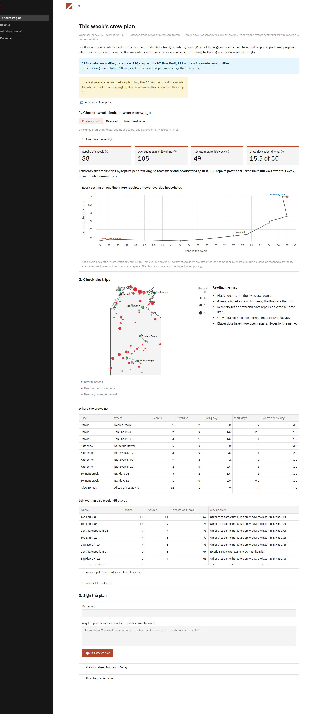
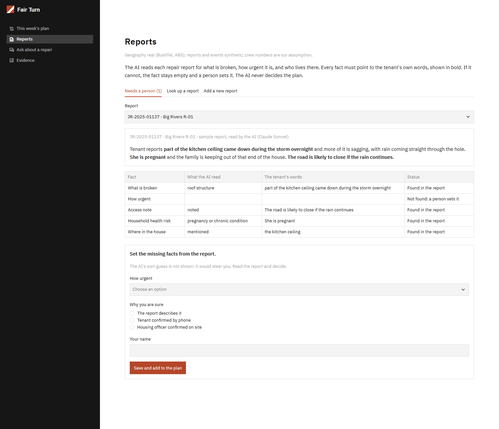
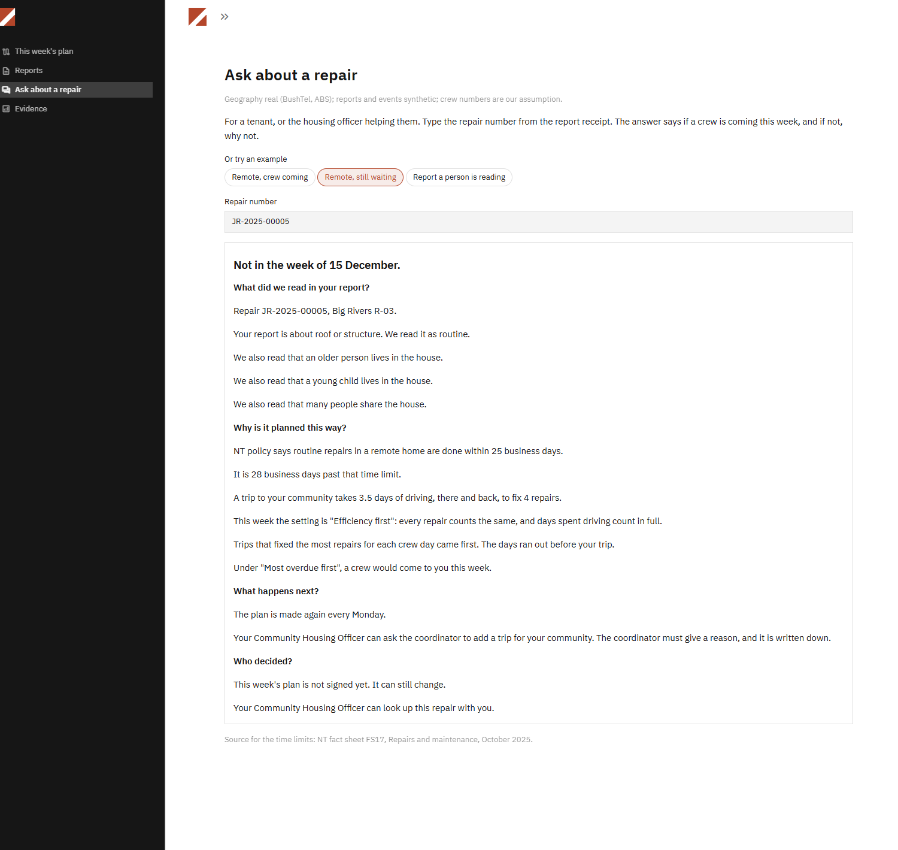
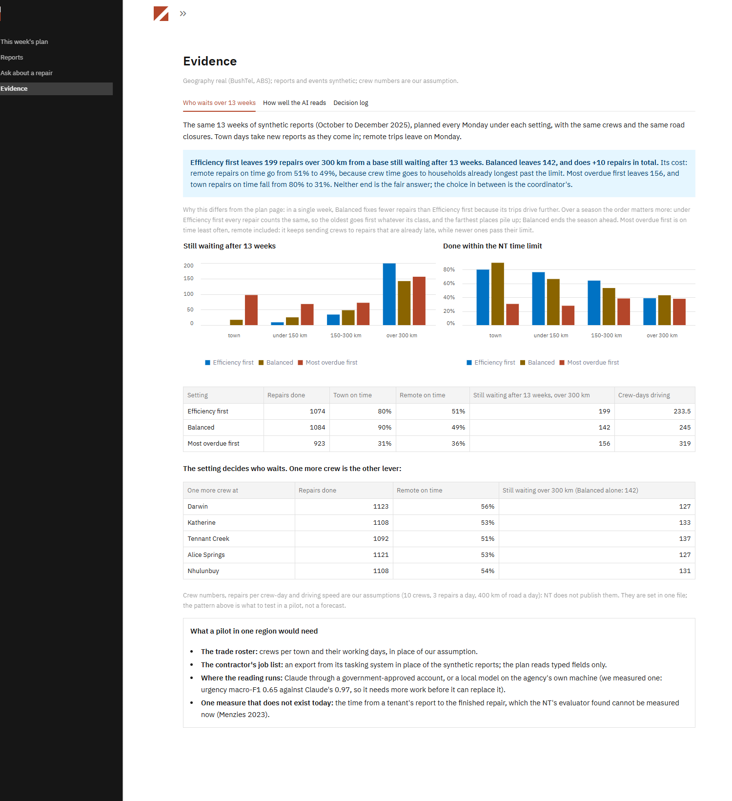

# Fair Turn

Decision support for the Northern Territory housing maintenance coordinator who schedules
the licensed trades (electricians, plumbers, refrigeration mechanics) working out of the
regional towns: **where do the crews go this week?** The AI reads tenants' free-text repair reports. A plain,
visible formula proposes the week's trips. The coordinator chooses how much weight to give
efficiency against the households waiting longest, sees exactly what that choice costs,
changes what they know better, and signs. A tenant can ask why their repair is or is not
in this week's plan and get a real answer.

Entry for the CDU IT Code Fair 2026 AI Challenge, brief 1 (housing maintenance triage).
Team AIC014.



## The idea in one paragraph

A crew in its own town fixes three repairs a day. A trip to a remote community spends days
on the road first. So the plan that fixes the most repairs keeps crews near town, and the
households far away wait longest: the brief's "efficiency" pressure. Fair Turn makes the
cost of a trip explicit, puts one setting in the coordinator's hands (Efficiency first ↔ Most
overdue first), and shows the whole trade-off on one line before anything is signed. On the
planning week of the synthetic data, Efficiency first fixes 88 repairs and leaves 105 overdue
households waiting, all remote; a little weight on need (0.2) fixes the same 88 and leaves
93; Balanced fixes 79 and leaves 82; Most overdue first fixes 46 and leaves 78. Over thirteen weeks, Balanced does more repairs than pure efficiency
(1,084 against 1,074) and leaves 142 instead of 199 repairs more than 300 km from a base
still waiting. Is this situation real, and who is the user? The public record behind
each part, and what is our assumption, are in [`docs/PRODUCT.md`](docs/PRODUCT.md).

## Run it (no accounts, no network)

Windows PowerShell:

```
py -3.13 -m venv venv
venv\Scripts\pip install -r requirements.txt
venv\Scripts\streamlit run fair_turn/app/main.py
```

POSIX (Bash):

```
python3.13 -m venv venv
venv/bin/pip install -r requirements.txt
venv/bin/streamlit run fair_turn/app/main.py
```

Python 3.13 is required. New to the app? [`docs/user-guide.md`](docs/user-guide.md) is a
five-minute walkthrough.

## The four pages

1. **This week's plan** — the coordinator's decision in three steps: choose the setting and
   read its cost; check the trips, the map and who is left waiting (each with its reason),
   adding or taking out a trip with a reason; sign with a name and a reason. Then the crew
   run sheet, Monday to Friday.
2. **Reports** — what the AI read from each report, every fact beside the tenant's own
   words. Reports it could not read wait here for a person, who sets the missing fact with a
   reason. New reports are added here, read live by Claude or a local model, or replayed
   from the test set with no model.

   

3. **Ask about a repair** — a tenant or housing officer types a repair number: is a crew
   coming this week; if not, the NT time limit and how far past it the repair is, how long
   the trip is, the setting chosen and what it means, whether another setting would have
   sent a crew, and who signed and why.

   

4. **Evidence** — thirteen weeks planned under each setting (who waits, by distance; on
   time in town and remote; one more crew at each base), how well the AI reads reports
   against a baseline and against attacks, and the decision log with its two clocks.

   

## What is real and what is synthetic

Geography real (BushTel, ABS): communities at their real coordinates and road access, under
pseudonymous region-coded ids (`data/raw/PROVENANCE.md`); the id-to-name key is not in this
repository. NT time limits are policy (fact sheet FS17, October 2025). Every tenant report,
its labels, the road closures and the October to December 2025 window are synthetic.
**Crew numbers, repairs per crew-day and driving speed are our assumptions** (NT does not
publish them), defined once in `fair_turn/core/constants.py` with a row in `constants.md`.

## How well the AI reads

The extractor (Claude Sonnet) read 150 held-out reports written by a different model
(Claude Opus). Macro-F1 against the labels, with a bag-of-words baseline for comparison;
every fact shown is a literal phrase of its report:

| Fact | Extractor | Word-count baseline |
|---|---|---|
| What is broken | **0.979** | 0.916 |
| How urgent | **0.969** | 0.861 |
| Household health risk | **0.983** | — |

36 reports written by an OpenAI model and read by the same extractor: urgency 0.944 against
the baseline's 0.667. All 20 manipulation attempts ("ignore previous instructions", "rank
it first") change the plan only by holding their report for a person. Synthetic text is
cleaner than real tenants' words: treat these as upper bounds. Local models were benchmarked
and not adopted (`MODELS.md`). Full tables: `data/build/eval.json`,
`data/build/report/`.

## Repository map

| Path | What it is |
|---|---|
| `docs/PRODUCT.md` | What the app does, the model, the numbers and what is not claimed. Start here. |
| `docs/user-guide.md` | The coordinator's Monday, step by step; the glossary. |
| `docs/demo-script.md` | The three-minute live demo for Challenge Day, with the likely questions. |
| `docs/report-brief.md` | What the project report should say, section by section, with every number's source. |
| `docs/competition-*.md`, `docs/task-briefs.md`, `docs/report-requirements.md` | The organiser's brief, deliverables and criteria, transcribed. |
| `docs/archive/` | The first version's PRD, design notes and build tasks, kept as history. |
| `CLAUDE.md`, `AGENTS.md` | Project rules and the binding architecture (Blueprint). `AGENTS.md` mirrors `CLAUDE.md` for Codex. The opening "TarikOS" section is the owner's assistant setup; ignore it on another machine. |
| `fair_turn/core` | The rules as pure Python: need and NT windows, the weekly planner, the season simulation, explanations, span verification, wording checks, the decision log. |
| `fair_turn/data`, `fair_turn/eval`, `fair_turn/llm` | Artefact loading, evaluation metrics, the model wrappers (only `scripts/` and `app/intake.py` call them). |
| `fair_turn/app` | The Streamlit app: `main.py`, one file per page under `pages/`. |
| `scripts/` | The build pipeline, `gate.py` (lint, format, tests) and `package_submission.py`. |
| `data/raw`, `data/build`, `data/audit` | Frozen public sources, the committed artefacts the app runs from, the sample decision log. |
| `tests/` | Unit, property and headless page tests; run them through `scripts/gate.py`. |

## Checks

`venv/Scripts/python scripts/gate.py` runs `ruff check`, `ruff format --check` and the full
pytest suite (unit, property and Streamlit `AppTest` page tests with the network refused),
stopping at the first failure. Nothing is done without it green.

## Rebuilding the artefacts

Everything above runs from the committed `data/build/` artefacts. To regenerate, in order
from the repo root:

```
venv/Scripts/python scripts/fetch_raw_sources.py      # frozen, already run; needs network once
venv/Scripts/python scripts/build_labels.py
venv/Scripts/python scripts/generate_text.py          # needs a logged-in `claude` CLI (Opus)
venv/Scripts/python scripts/extract.py                # needs a logged-in `claude` CLI (Sonnet)
venv/Scripts/python scripts/build_challenge_set.py    # needs logged-in `codex` and `claude`
venv/Scripts/python scripts/run_eval.py
venv/Scripts/python scripts/export_report_tables.py   # the plan and season tables
venv/Scripts/python scripts/seed_audit.py             # the sample decision log
```

Only `generate_text.py`, `extract.py` and `build_challenge_set.py` call a model, through a
subscription CLI already logged in on the machine; no API key is used anywhere.

## Live intake (optional)

The app runs with no model. To read new reports live, set `FAIR_TURN_PROVIDER` before
starting Streamlit (or choose in the "Who reads the report" box):

```
$env:FAIR_TURN_PROVIDER = "claude"         # PowerShell
export FAIR_TURN_PROVIDER=claude           # Git Bash
```

`claude` needs a logged-in `claude` CLI (Sonnet); `ollama` runs `qwen3:8b` locally
(`ollama pull qwen3:8b` first). New reports and fields a person sets go to
`data/runtime/runtime.jsonl` (gitignored) and join this week's proposal.

## Licences and sources

Reduced from `data/raw/PROVENANCE.md`:

| Source | Licence |
|---|---|
| BushTel (communities, community detail) | NT Open Data Creative Commons licence; attribution: Department of Housing, Local Government and Community Development, Northern Territory, BushTel community data, sourced 12 September 2026, https://bushtel.nt.gov.au/ |
| NT fact sheet FS17, Repairs and maintenance (10/2025) | © Northern Territory Government; quoted for its response times under fair dealing for research and review |
| NT road report (obstructions) | to be confirmed |
| NT open data mobile coverage 2021 | Creative Commons Attribution |
| Natural Earth admin-1 outline | Public domain |
| BoM monthly mean-maximum normals | CC BY 4.0; attribution: Bureau of Meteorology, © Commonwealth of Australia. Values still unverified |

## Packaging

```
venv/Scripts/python scripts/package_submission.py --team AIC014
```

Refuses on a dirty working tree or a red gate; writes
`dist/AI-Challenge_Team-AIC014_FairTurn.zip`.
