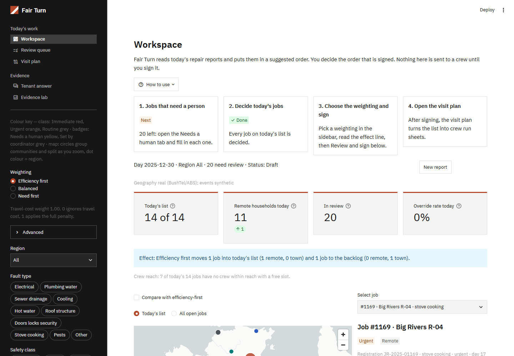
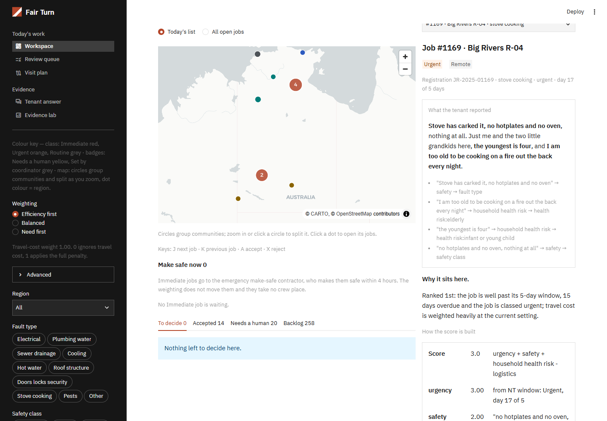
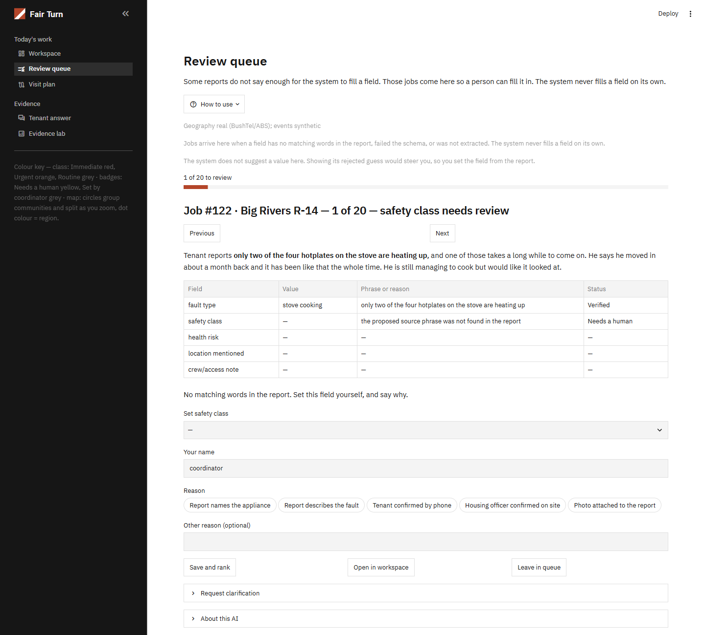
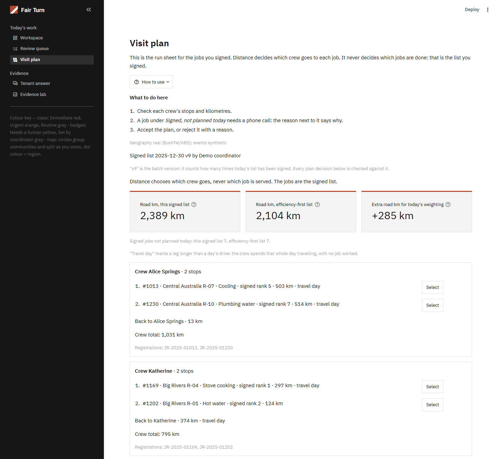
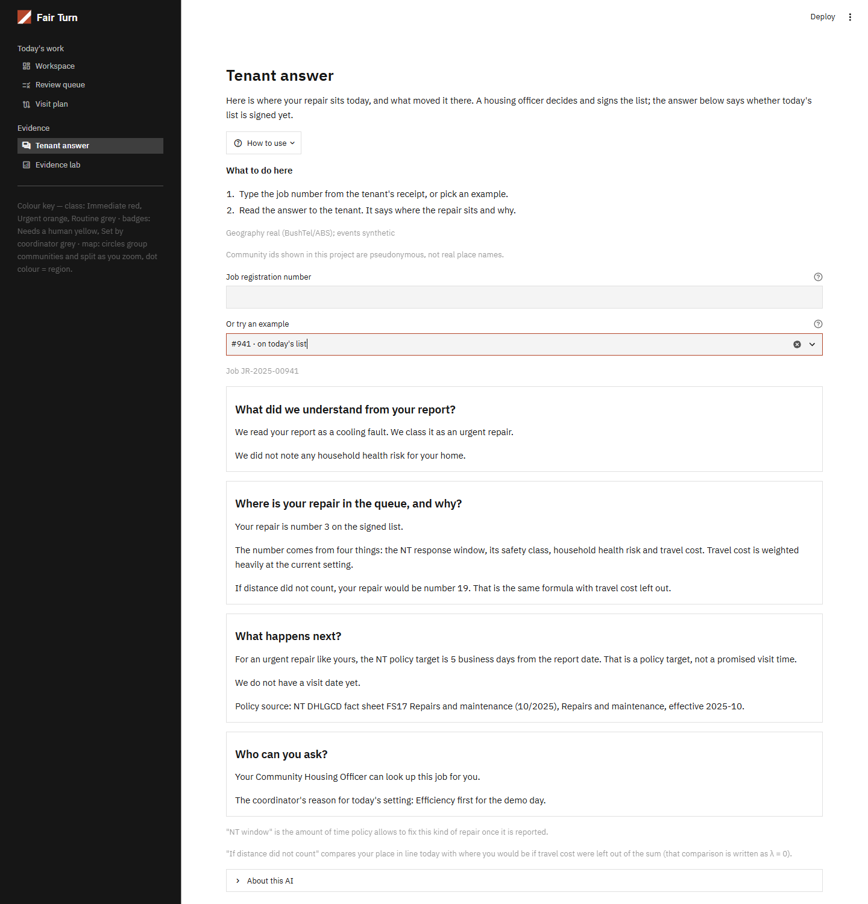
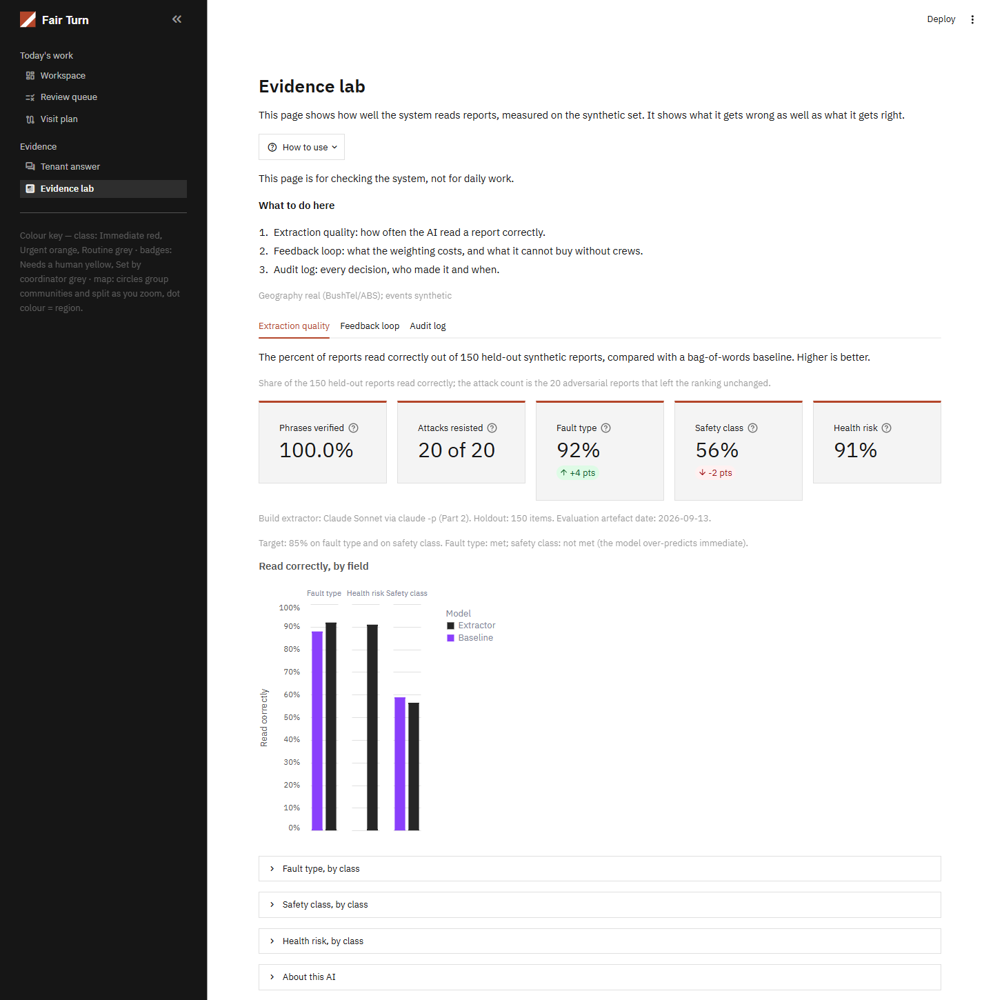
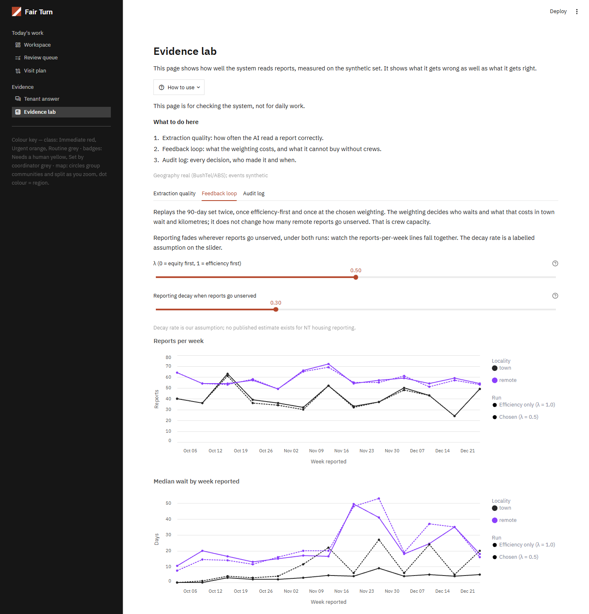

# Fair Turn

Decision support for triaging housing maintenance requests across the Northern Territory:
free-text fault reports are read into typed fields, a transparent formula ranks the open
jobs, and a coordinator owns the equity trade-off between efficiency and remote-community
need through one weighting (Efficiency first, Balanced, Need first), decides each job, signs
the list, and can explain it to a tenant. Entry for the CDU IT Code Fair 2026 AI Challenge,
brief 1 (housing maintenance triage). Team `<N>`.



**Status (2026-09-15):** feature-complete and in the hands of the team for testing. Changes
from here follow the feedback in `reports/` (see "Testing it and sending feedback").

## Run it (no accounts, no network)

Windows PowerShell:

```
py -3.13 -m venv venv
venv\Scripts\pip install -r requirements.txt
venv\Scripts\streamlit run fair_turn/app/main.py
```

POSIX (Bash):

```
python3.13 -m venv venv
venv/bin/pip install -r requirements.txt
venv/bin/streamlit run fair_turn/app/main.py
```

Python 3.13 is required.

New to the app? Read [`docs/user-guide.md`](docs/user-guide.md) first, or open the
"How to use" popover in the sidebar of any page.

## The five screens

1. **Workspace** — the coordinator's page. Today's list within crew capacity, the backlog,
   a Needs a human tab, the map, the selected-job pane with every field shown at its source
   phrase, the weighting (Efficiency first, Balanced, Need first), one accept or reject per
   job with a reason, and the sign-off form. Also the New report intake box and a DEV OPTION
   that adds a made-up test report.

   

2. **Review queue** — one job at a time where a required field has no source phrase in the
   report. The coordinator sets the field by hand, with a reason, and the job enters the
   ranking marked "Set by coordinator".

   

3. **Visit plan** — the signed list as crew run sheets. Distance decides which crew goes,
   never which job is done; signed jobs no crew can take today are listed with the reason.

   

4. **Tenant answer** — one job looked up by registration number, answered in plain
   language: where it sits, why, and the NT policy window, with the passage it comes from.

   

5. **Evidence lab** — how well the extractor reads reports against the labelled set, the
   90-day feedback-loop simulation, and the audit log with its two clocks.

   

   

Screenshots show the synthetic dataset day 2025-12-30, after deciding and signing today's
list with the Efficiency first weighting.

## Repository map

For a teammate, or an AI agent helping one. Read in this order: this file,
`docs/user-guide.md`, then `docs/PRD.md` section 3.

| Path | What it is |
|---|---|
| `CLAUDE.md`, `AGENTS.md` | Project rules (Part 1) and the binding architecture (Blueprint). `AGENTS.md` is generated from `CLAUDE.md`; never edit it by hand. The opening "TarikOS" section is the owner's personal assistant setup: on any other machine the session hook prints a warning that the brain was not found. Ignore it; Part 1 and Blueprint are what bind. |
| `docs/PRD.md` | The product spec. Section 3 says what each screen shows, section 6 the models behind the numbers, section 7 the acceptance checks. Amendments are dated in place. |
| `docs/user-guide.md` | How to use the app, a coordinator's morning step by step, the keyboard path, the glossary. |
| `docs/competition-*.md`, `docs/report-requirements.md` | The organiser's brief, deliverables and judging criteria, transcribed verbatim. |
| `docs/TASKS_INDEX.md`, `tasks/` | The build history, one file per task. All done; kept as the record of why things are the way they are. |
| `design/` | Wireframes, the design system, screenshots of the built screens. |
| `fair_turn/core` | The rules as pure Python: scoring, capacity and feedback simulations, visit plan, audit, wording. No pandas, no Streamlit, no network. |
| `fair_turn/data`, `fair_turn/eval`, `fair_turn/llm` | Artefact loading, evaluation metrics, and the model wrappers (only `scripts/` and `app/intake.py` call them). |
| `fair_turn/app` | The Streamlit app: `main.py`, one file per screen under `pages/`, shared pieces under `components/`. |
| `scripts/` | The build pipeline, `gate.py` (lint, format, tests) and `package_submission.py`. |
| `data/raw`, `data/build`, `data/audit` | Frozen public sources with provenance, the committed artefacts the app runs from, and the seeded audit sample. `data/runtime/` is local and never committed. |
| `reports/` | Research and run reports, including the usability test. |
| `BACKLOG.md`, `constants.md`, `MODELS.md`, `notes.md` | Deferred work with reasons, every policy number with its source, the model decisions with evidence, and the original raw dump. |
| `tests/` | Unit, property and headless page tests; run them through `scripts/gate.py`. |

## Testing it and sending feedback

1. Run the app (above), open the "How to use" popover in the sidebar, and follow a
   coordinator's morning in `docs/user-guide.md` section 3. Try to break it.
2. Write what you found as `reports/feedback-<your-name>-<date>.md`, using the sections of
   `reports/usability-test-fair-turn-2026-09-15.md`: page, exact steps, expected, actual, and
   the labels that confused you. A GitHub issue works too.
3. Nothing lands on `main` without `scripts/gate.py` green. Work on a branch; the gate is
   the only reviewer that cannot be argued with.
4. If an AI agent is helping you: give it this file, `docs/user-guide.md` and
   `docs/PRD.md` section 3. It must not edit `CLAUDE.md` Blueprint or anything under
   `data/build/`; those are decisions and artefacts, not code.

## What is real and what is synthetic

Geography real (BushTel/ABS); events synthetic. Communities are shown at their real
coordinates with real attributes, but under pseudonymous, region-coded ids
(`data/raw/PROVENANCE.md`); the id-to-name key is not in this repository. Every fault
report's text, its extracted labels and the 90-day event window are synthetic, generated
and labelled by the build pipeline, not real tenant data.

## Evaluation numbers

Full tables: `data/build/eval.json` (machine-readable), `data/build/eval_tables.md`
(rendered), `data/build/report/` (the tables and figures the project report quotes).

Extractor (Claude Sonnet) macro-F1 against the *provisional* 0.85 target, on the 150-item
holdout set (texts written by Claude Opus); every shown field is a literal substring of its
report:

| field | extractor | TF-IDF baseline |
|---|---|---|
| `fault_type` | **0.979** | 0.916 |
| `safety_class` | **0.969** | 0.861 (finds 50 % of Immediate jobs; the extractor 100 %) |
| `health_risk` | **0.983** | — |

**Cross-vendor challenge set** (`scripts/build_challenge_set.py`): 36 reports written by an
OpenAI model from the same prompt, read by the same extractor. Safety class 0.944 against
the baseline's 0.667, fault type 0.904 against 0.764. The bag-of-words baseline learns the
generator's style; the extractor does not depend on it.

Before 2026-10-01 safety class scored 0.564: the generator never saw the class definitions
the extractor reads, so 386 of 652 "urgent" texts described an immediate danger. The
definitions now live once in `fair_turn/llm/prompts.py` and the set was regenerated with the
extractor prompt unchanged (`reports/audit-2026-10-01.md`). Synthetic text written to the
definitions is cleaner than real tenant text; treat these as upper bounds.

Local models were benchmarked on the earlier text set (`data/build/eval_ollama*.json`,
`MODELS.md`): `qwen3:8b` reached 0.688 / 0.561 and was not adopted.

**Simulation** (`data/build/report/`): at efficiency-first (λ = 1) 422 of 807 remote crew
jobs are still open at day 90 and the remote median wait is 17 days; at equity-first
(λ = 0) 308 and 11 days, paid for by 28 → 120 open town jobs and 60k → 92k road km. A
second crew per remote region leaves 201 open even at λ = 1 (`capacity_sensitivity.csv`).

## Rebuilding the artefacts

Everything above runs from the committed `data/build/` artefacts with no rebuild needed.
To regenerate them, run in order from the repo root:

```
venv/Scripts/python scripts/fetch_raw_sources.py   # frozen, already run; needs network once
venv/Scripts/python scripts/build_labels.py
venv/Scripts/python scripts/generate_text.py       # needs a logged-in `claude` CLI (Opus)
venv/Scripts/python scripts/extract.py             # needs a logged-in `claude` CLI (Sonnet)
venv/Scripts/python scripts/build_challenge_set.py     # needs logged-in `codex` and `claude` CLIs
venv/Scripts/python scripts/run_eval.py
venv/Scripts/python scripts/export_report_tables.py
venv/Scripts/python scripts/seed_audit.py            # the committed audit sample
```

`generate_text.py`, `extract.py` and `build_challenge_set.py` are the only steps that call a model, through a
subscription CLI already logged in on the machine that runs them; no API key is used or
accepted anywhere in this repository. The app and the test suite never call a model or
open a network connection.

## Live intake (optional)

Nothing above requires it: the app runs and every surface renders with no provider set. To
enable the workspace's "New report" extraction against a live model, set `FAIR_TURN_PROVIDER`
before starting Streamlit.

PowerShell:

```
$env:FAIR_TURN_PROVIDER = "claude"
venv\Scripts\streamlit run fair_turn/app/main.py
```

Git Bash:

```
export FAIR_TURN_PROVIDER=claude
venv/Scripts/streamlit run fair_turn/app/main.py
```

`claude` requires a logged-in `claude` CLI on the machine (Sonnet, the same wrapper the build
uses); `ollama` is selectable with `FAIR_TURN_PROVIDER=ollama` and runs `qwen3:8b` locally
(`ollama pull qwen3:8b` first). The benchmark (`scripts/benchmark_provider.py`, results
above) kept `claude` as the default. The intake box also has a provider selector that
overrides the variable for the session. A submitted report,
its extraction, and any coordinator-set field are appended to `data/runtime/runtime.jsonl`
(gitignored, never committed) and merged into the ranking alongside the committed artefacts.

## Policy index

`data/build/policy_passages.json` is committed, so a judge never needs to rebuild it. To
regenerate it after changing the source fact sheet or the retrieval threshold, a running
Ollama with the `bge-m3` model pulled is required:

PowerShell:

```
venv\Scripts\python scripts\build_policy_index.py
```

Git Bash:

```
venv/Scripts/python scripts/build_policy_index.py
```

The indexed source, `data/raw/nt_fs17_repairs_and_maintenance_2025-10.pdf`, is © NT Government
and is quoted with attribution in the app. Its reuse is fair dealing for research and
review under the NT Government copyright statement (no Creative Commons licence is stated
on FS17); a pilot would need DHLGCD permission before republishing the text.

Ollama chat extraction (`qwen3:8b`) is a separate, later benchmark (Task-36) against the same
150-item and adversarial tables Claude is scored on; it is not the default provider unless that
benchmark shows it is not below Claude on both required fields.

## Checks

`venv/Scripts/python scripts/gate.py` runs `ruff check`, `ruff format --check` and the
full pytest suite (unit, property and Streamlit `AppTest` smoke tests), stopping at the
first failure. It is the only gate; nothing is DONE without it green.

## Licences and sources

Reduced from `data/raw/PROVENANCE.md`:

| Source | Licence |
|---|---|
| BushTel (communities, community detail) | NT Open Data Creative Commons licence; attribution: Department of Housing, Local Government and Community Development, Northern Territory, BushTel community data, sourced 12 September 2026, https://bushtel.nt.gov.au/ |
| NT road report (obstructions) | to be confirmed |
| NT open data mobile coverage 2021 | Creative Commons Attribution |
| Natural Earth admin-1 outline | Public domain |
| BoM monthly mean-maximum normals | CC BY 4.0; attribution: Bureau of Meteorology, © Commonwealth of Australia. Licensed from the Commonwealth of Australia under a Creative Commons Attribution 4.0 International licence. Values still unverified |

## Packaging

```
venv/Scripts/python scripts/package_submission.py --team <N>
```

Refuses on a dirty working tree or a red gate; writes
`dist/AI-Challenge_Team-<N>_FairTurn.zip`.
