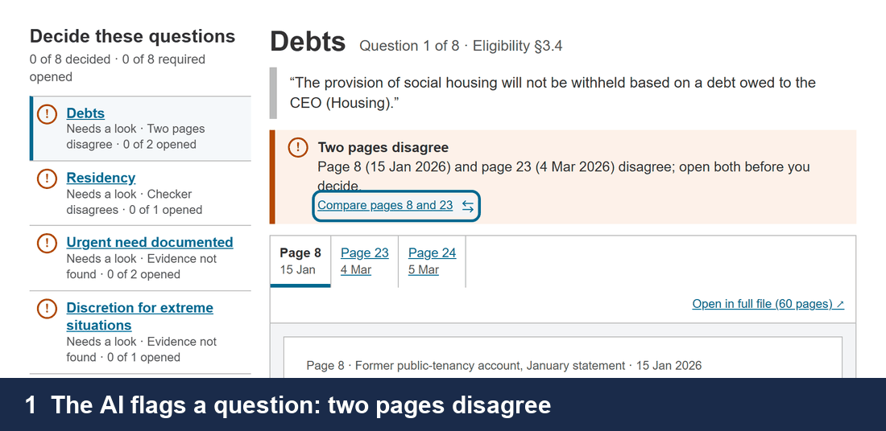
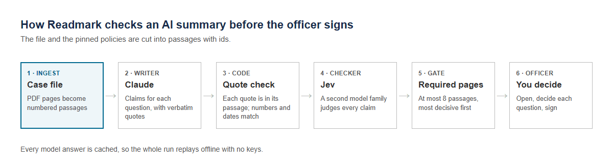
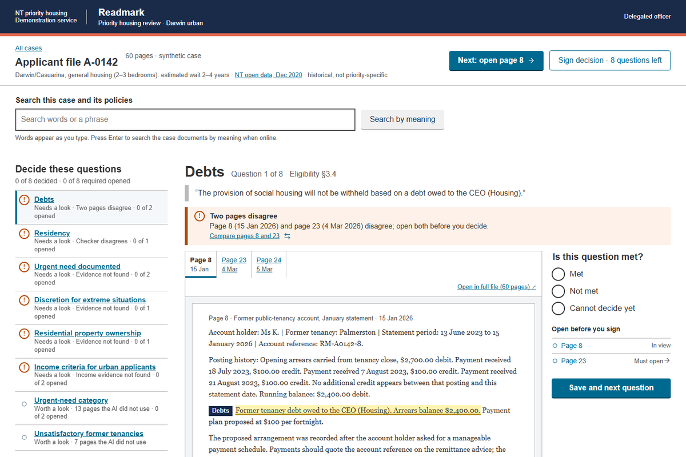
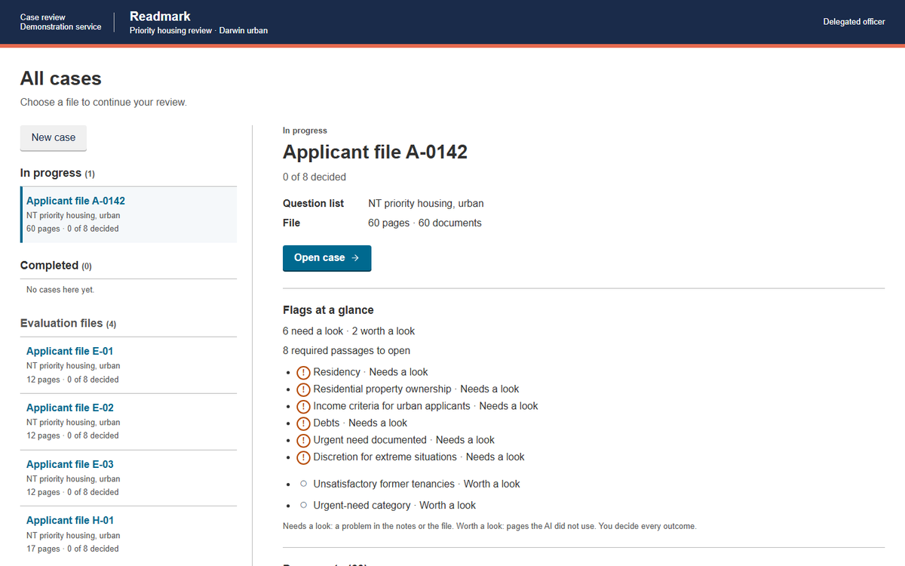
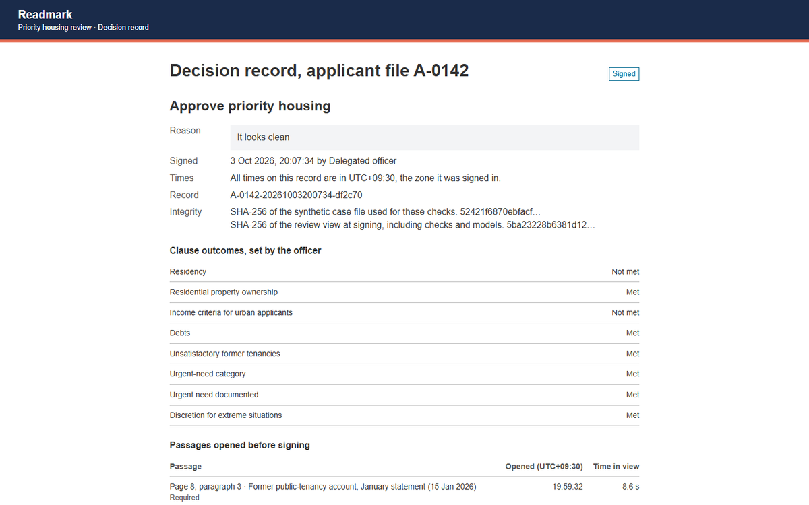

# Readmark

**An AI reads the case file and points. The officer reads the pages it points to, and decides.**



Think of an exam answer key. It does not grade the paper for you; it shows where on the page the
answer should be. Readmark does the same for an NT delegated officer who assesses an urban
priority-housing application. The application is a 60-page file, and an AI summary of it can be
wrong in ways that look right.

- **Quotes first.** For each decisive policy question, the screen shows the real passage in the
  file, highlighted and labelled with its question. The AI's own sentences sit behind a fold.
- **Every claim is checked twice.** Plain code checks that each quote is really in the file.
  A second model from a different family checks that the quote supports the claim.
- **The officer decides.** The required pages must be opened before sign-off. The app never
  recommends an outcome, and no answer is pre-selected.

CDU IT Code Fair 2026, AI Challenge brief 6, team AIC014. The case files are synthetic. The NT
policies are real and are not bundled.

## Quick start: replay, no keys, no network

You need Python 3.13 and [uv](https://docs.astral.sh/uv/) 0.12 or later. The results of both
showcase cases are committed, so opening them needs nothing else:

```sh
uv sync
uv run python -m readmark serve      # http://localhost:8765/ : A-0142 and W-01 on the case home
```

Without the policy PDFs, only the full text of a policy page stays closed; the quoted policy
sentences still show. To rebuild the results, save the policy PDFs first (see
[Policy PDFs](#policy-pdfs); the NT housing site blocks scripted downloads), then:

```sh
uv run python -m readmark run --case A-0142 --replay   # rebuilds runs/A-0142/ from the cache
uv run python -m readmark run --case W-01 --replay
```

Every model response from our runs is in the replay cache (`runs/<case>/cache/`), so replay
rebuilds every stage file byte for byte. A-0142 is the demo file. `stub` is a 6-page file the
tests use.

## How it works



1. **Ingest:** the case file and the pinned policy PDFs become numbered passages.
2. **Writer:** Claude finds everything that could change the decision, for and against, with
   verbatim quotes, or says what is missing.
3. **Code checks:** each quote must be in its passage; every number and date in a claim must
   appear in a cited quote.
4. **Checker:** Jev, a different model family, judges each claim. It also scans every page for
   relevant passages that no claim used, and compares pages that may disagree.
5. **Gate:** failed checks and record pairs become required reading: at most 8 pages, most
   decisive first.
6. **Officer:** opens them, sets each question's outcome, and signs.

<details>
<summary>Each stage in detail (files and rules)</summary>

`python -m readmark run` runs each stage once and writes `runs/<case>/<stage>.json`.

1. **Ingest** (`readmark/ingest/`): passages get ids `<case>:p<page>:<paragraph>`. Stage files keep
   policy passages as offsets and hashes only; the server reads policy text from the PDFs when a
   passage is opened.
2. **Question list** (`readmark/checklist/`): the decisive questions, each anchored to its verbatim
   policy sentence. Each list brings its own policies and questions.
3. **Writer** (`readmark/writer/`): Claude gets a goal, not steps.
4. **Code checks** (`readmark/checks/`): a failure shows as "quote not found".
5. **Checker** (`readmark/jev/`): supports, contradicts, or not enough information, on every claim.
6. **Relevance scan** (Jev, `scan.json`): every case passage is scored 0 to 4 against each question,
   20 passages per call. A passage at or above the threshold that no claim cites is "worth a look".
   The threshold was set once on A-0142 with its gold file; `scan.json` records how.
7. **Record pairs** (Jev, `pairs.json`): for each question, up to five passages that matter
   most are compared pair by pair: agree, updated, contradict or unrelated. Updates and
   disagreements both feed required reading. A one-sided claim is checked against
   the other passage before it can be flagged as contradicted.
   This catches a real quote that is out of date, which every check against its own passage passes.
8. **Gate** (`readmark/gate/`): one entry per page, retaining every flagged passage and its reasons.
   Connected updates share their strongest comparison's two primary pages; intermediate records
   remain suggested unless independently flagged. Unused slots retain cited case evidence without
   creating another error warning.
9. **View** (`runs/<case>/view.json`, schema version 4), served by `readmark/serve.py` to `web/`.

</details>

## What else is on the screen

- **Case home:** A-0142 (NT priority housing), W-01 (NT Working with Children Clearance)
  and your own uploads, grouped as in progress or completed. Evaluation
  files stay available to `run` and `eval`, and stay off the home screen.
- **Intake note:** a receiving officer's neutral description of what the file holds. Close it
  or reopen it with **Intake note**; it never recommends an outcome.
- **New case:** upload several documents (PDF or text) and run the checks live.
- **Scanned pages:** Claude reads the page image, and the image stays beside the text.
- **Document dates:** Claude reads when each uploaded record was issued, signed or printed.
  Code checks its quoted date; hover the date to see the evidence. Missing or unverified dates
  stay unknown, and uploads still continue. Date responses join the case's offline replay cache.
- **Search:** words always; meaning through Jev when online.
- **Question-list coverage:** Jev shows decisive policy rules that no question covers
  (`python -m readmark lists --coverage <list-id>`).

<details>
<summary>Screens: a question, case home and the signed decision record</summary>







</details>

The decision record can be exported as HTML or JSON and is saved under `runs/<case>/records/`.
Opening a passage is recorded; it does not prove it was read, so the record says "opened".

## Evaluation

```sh
uv run python -m readmark eval --part <checker|cases|mutations|ablation|benchmark> --replay
```

Every number goes to `runs/eval/summary.json` with its n: the checker on SummEdits, end-to-end
case files, a mutation set of broken claims, a held-out file written blind (H-01), and an ablation
that adds one layer at a time.

## Live runs with your own keys

A live run sends the synthetic case file and the policy passages to two model services. Never use
it with real case data.

- **Writer:** Claude through the Claude Code CLI (`claude -p --model opus --json-schema`). Install
  it and sign in; there is no API key to set.
- **Checker:** Jev (TypeSafe) at `https://api.typesafe.ai/v1/systemone`. Put your key in the
  environment or in a git-ignored `.env` at the repo root: `TYPESAFE_API_KEY=...`.

```sh
uv run python -m readmark run --case A-0142                    # Claude writer, Jev checker
uv run python -m readmark run --case A-0142 --checker claude   # Claude as the second key too
```

The relevance scan and the contradiction pairs always run on Jev. New responses are added to the
cache. Jev is not deterministic, so a fresh live run can give different verdicts from the cache.

## Check it

```sh
uv run playwright install chromium   # once, for the screen test
uv run python scripts/gate.py
```

The gate runs `ruff check`, `pytest` (including a headless browser test of the review screen) and
a replay smoke test of the stub and A-0142 with no API key, which validates each `view.json`
against `readmark/schemas/view.schema.json`. Exit 0 means clean.

## Policy PDFs

<details>
<summary>The five NT policy PDFs, downloaded by hand (names, sources, SHA-256)</summary>

The NT Government site blocks scripted downloads, so the PDFs are fetched in a browser and saved
in `data/policies/` under the names below. They are NTG copyright, so they are git-ignored. The
competition submission ZIP includes them, and the two NT legislation PDFs, for judging only.
Ingest checks each file against its SHA-256 in `data/policies/policies.lock.json`
and stops, naming the file, if one differs.

| Save as | Download from | Version | SHA-256 |
|---|---|---|---|
| `priority-housing-policy.pdf` | <https://dhlgcd.nt.gov.au/media/documents/policies,-procedures-and-guidelines/accessing/priority-housing-policy.pdf> | 2.04 | `ea6c52753092bb22a71689862fe8e9a06bc80f604f3ae6b74b5302da4eab12d5` |
| `eligibility-for-social-housing-policy.pdf` | <https://dhlgcd.nt.gov.au/media/documents/policies,-procedures-and-guidelines/accessing/eligibility-for-social-housing-policy.pdf> | 7.1 | `f628d219bf38bea1a8156364f8d2b665eae4d6c37e097e6e4869fb0dd7f64fbf` |
| `identification-and-documentation-policy.pdf` | <https://dhlgcd.nt.gov.au/media/documents/policies,-procedures-and-guidelines/accessing/identification-and-documentation-policy.pdf> | 4.02 | `ce59a9a3b24a6a7f2e8a505a3588c86b93ea321cd39048a12b1072797fa97404` |
| `domestic-family-violence-policy.pdf` | <https://dhlgcd.nt.gov.au/media/documents/policies,-procedures-and-guidelines/living/domestic-family-violence-policy.pdf> | 2.01 | `5209d377b63a291af8386245c539aa0ded413581adb2af7e60bb0332314d5bde` |
| `discretionary-decision-making-policy.pdf` | <https://dhlgcd.nt.gov.au/media/documents/policies,-procedures-and-guidelines/foundations/discretionary-decision-making-policy.pdf> | 2.02 | `275b445c9e0e2241064c28a90ff5a5f260f5c05ec17290fc10848d228014ffdd` |

If the site has published a newer version, its SHA-256 will differ and ingest will stop. Re-pin it
on purpose (update `policies.lock.json` and check that `readmark/checklist/clauses.yaml` still
matches word for word), never silently.

</details>

W-01 contains 24 synthetic application PDFs (104 pages), with `facts.csv`, `gold.json` and
`intake-note.json` in `data/cases/W-01/`. Its run is committed and replays
offline like A-0142. The answer key is evaluation data, never model input.

Download its two fixed test rule PDFs from the NT legislation site:

```sh
uv run python scripts/fetch_wwcc_rules.py
```

The script uses a browser User-Agent, verifies both downloads before saving, and rejects any
SHA-256 mismatch. `data/policies/nt-wwcc/policies.lock.json` pins the Act as in force at
31 August 2026 and the Screening Regulations as in force at 25 March 2024. The PDFs remain
git-ignored. These are the supplied test versions.
